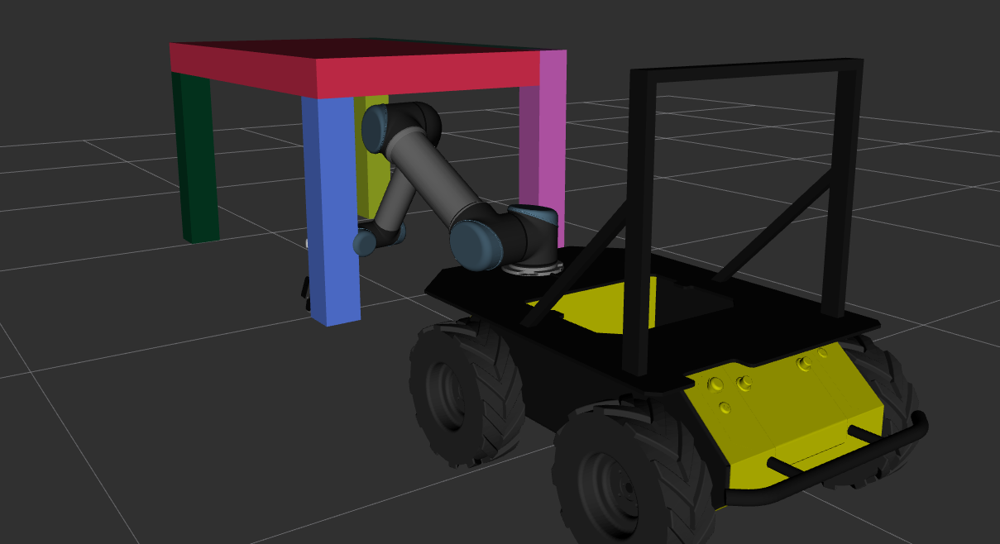

# Stabilizing Manipulator Trajectory via Collision-Aware Optimization

This repository with code for paper: https://link.springer.com/chapter/10.1007/978-3-031-71360-6_3

This repository contains code for scaling the obstacles obtained from the octomap. The octomap can be obtained from the sensors of the robot (depth camera or lidar) or generated from the library of objects (table, closet, chair, wall, trash can).

Installed libraries: PCL, Boost, Octomap, Eigen.

A detailed example of use in the code can be found in the file "examples/example.cpp". the example uses MoveIt! framework.

